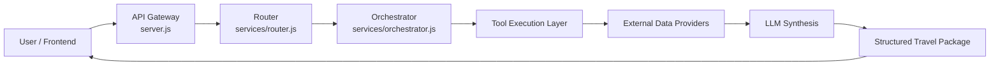
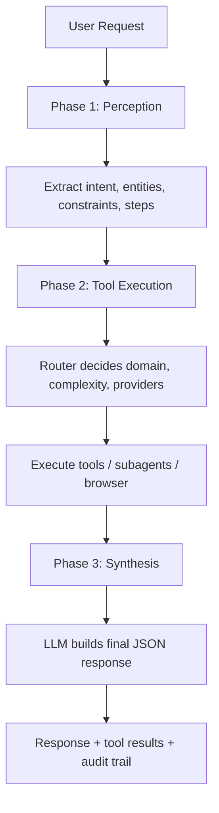
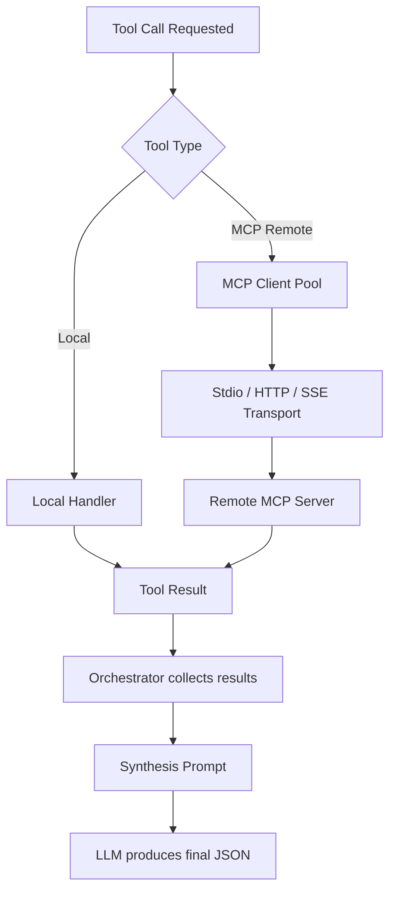
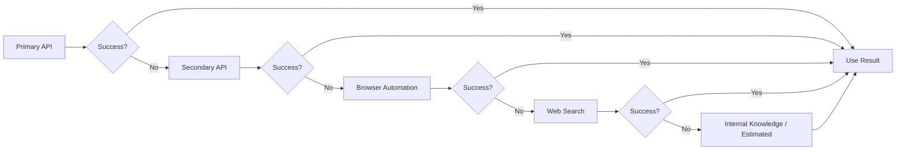
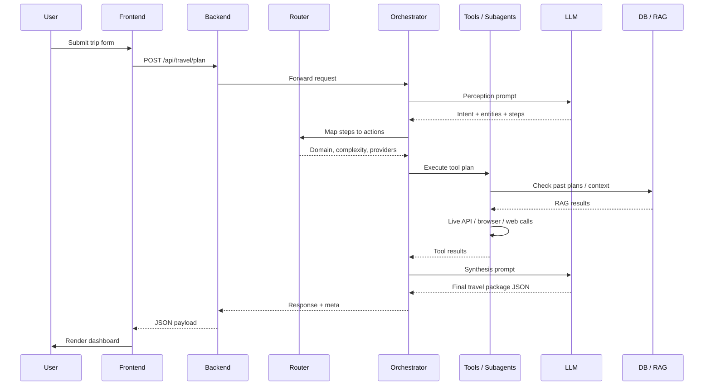
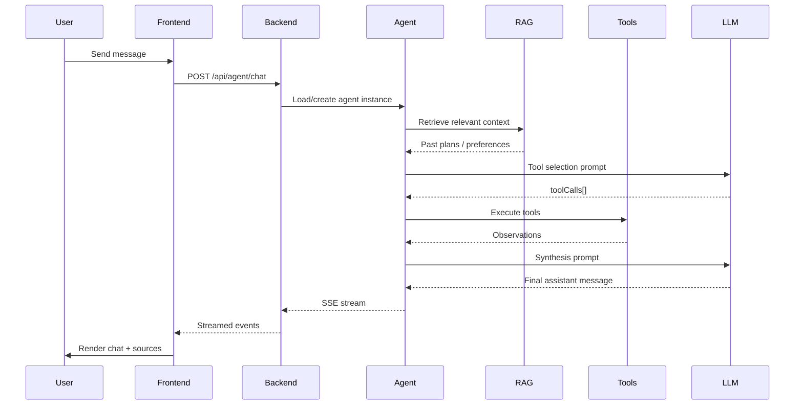

# Wanderlust Agentic System Map

## High-Level Flow

## Orchestrator Phases

## Core Components

```mermaid
flowchart LR
  subgraph Frontend
    F1[Landing Page]
    F2[Dashboard]
    F3[Agent Chat]
    F4[Internal Lab]
  end

  subgraph Backend
    B1[Express Server]
    B2[Travel Routes]
    B3[Agent Routes]
    B4[Internal Routes]
    B5[Browser Routes]
  end

  subgraph AgenticCore
    A1[Router]
    A2[Orchestrator]
    A3[Tool Registry]
    A4[MCP Client Pool]
    A5[RAG Store]
    A6[AI Evaluation]
    A7[Fusion Layer]
    A8[Cache]
  end

  subgraph DataSources
    D1[Google Places]
    D2[Ola Maps]
    D3[OpenStreetMap]
    D4[Web Search]
    D5[Browser Automation]
    D6[LLM Providers]
  end

  Frontend --> Backend
  Backend --> AgenticCore
  AgenticCore --> DataSources
```

## Tool Execution Path

## Fallback Chain

## Data Flow for a Plan Request

## Agent Chat Flow

## Key Files Reference

| Layer | File | Role |
|-------|------|------|
| Entry | `backend/server.js` | Express app, CORS, routes, health |
| Routes | `backend/routes/travel.js` | Travel plan + details endpoints |
| Routes | `backend/routes/agent.js` | Agent chat + SSE streaming |
| Routes | `backend/routes/internal.js` | Research, memory, browser |
| Routes | `backend/routes/browser.js` | Browser automation API |
| Router | `backend/services/router.js` | Domain classification, provider priority |
| Orchestrator | `backend/services/orchestrator.js` | Perception → tools → synthesis |
| LLM | `backend/services/ollamaClient.js` | Cloud LLM JSON calls |
| Tools | `backend/agents/tools/planTools.js` | Plan modify/search/email tools |
| Agent | `backend/agents/emailAgent.js` | Specialized plan assistant |
| RAG | `backend/rag/ragStore.js` | Plan memory + search |
| MCP | `backend/assistant/mcpClient.js` | Remote MCP server connections |
| Registry | `backend/assistant/toolRegistry.js` | Unified tool catalog |
| Fusion | `backend/services/fusion.js` | Multi-provider merge/normalize |
| Cache | `backend/services/cache.js` | In-memory / Redis cache |
| Eval | `backend/services/aiEvaluation.js` | Intent + save gates |
